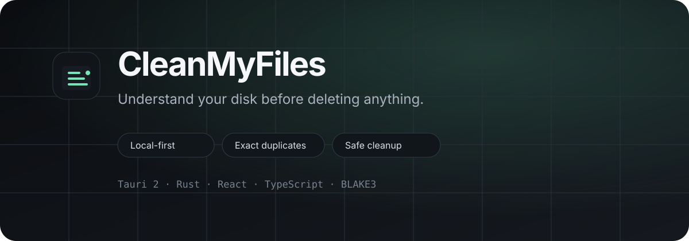

 

English · Русский

A local-first desktop disk analyzer that helps you see what is taking space — before you remove anything.

No account · No cloud scan · No automatic purge

Download · Roadmap · Report a bug · Request a feature

Why CleanMyFiles?

Disk cleanup tools often make a simple problem feel risky: they show a large number, label files as “junk”, and encourage you to delete first and ask questions later.

CleanMyFiles takes the opposite approach. It is built to inspect first, explain clearly, and only remove files you explicitly select.

Scan a drive
    ↓
Understand where the space went
    ↓
Review duplicates, large files and cleanup candidates
    ↓
Select only what you want
    ↓
Move it to the system Trash / Recycle Bin

Your scan data and file contents stay on your machine.

Features

Capability

What it does

🗂️

Drive & folder scanning

Scan an entire drive or any folder you choose

📊

Storage overview

Break down analyzed space by type and top-level folder

🧭

Live progress

See scan progress in real time and cancel when needed

🧬

Exact duplicates

Verify duplicates by size → quick fingerprint → full BLAKE3 hash

📦

Large files

Surface the heaviest files found during a scan

🕰️

Old files

Find large files older than your configured threshold

⬇️

Downloads view

Review files located under Downloads inside the scan root

🧹

Cleanup candidates

Surface conservative cache, temp and old-installer candidates

👁️

Reveal in file manager

Open any surfaced file in Explorer / Finder / file manager

🗑️

Safe removal

Move explicitly selected files to the OS Trash / Recycle Bin

⚙️

Exclusions & thresholds

Tune duplicate size, large-file size, file age and ignored folders

🌐

Browser preview

Run the UI with representative sample data for frontend work

[!IMPORTANT]
Cleanup candidates are candidates, not guarantees that a file is disposable. CleanMyFiles intentionally avoids automatic destructive decisions.

Safety by design

CleanMyFiles is intentionally closer to a disk inspector than a one-click cleaner.

Nothing is selected automatically when a scan finishes.

Scanning never deletes files.

Duplicate groups require a full content hash match.

Select extra copies keeps one file in each duplicate group unselected for review.

Cache, temp and installer results are shown conservatively and require manual confirmation.

Symbolic links are not followed during traversal.

Removal uses the operating system Trash / Recycle Bin, not permanent deletion.

File paths and analyzed contents stay local to the machine.

A byte-for-byte duplicate can still matter if an application expects that file at a particular path. Review before removing.

App views

Overview
├─ drive usage
├─ analyzed bytes
├─ duplicate waste
├─ file-type breakdown
└─ top-level folder map

Duplicates
├─ exact content-match groups
└─ select extra copies

Large files
└─ top 100 surfaced files

Old files
└─ large files older than your age threshold

Downloads
└─ files found under Downloads

Cleanup
└─ cache / temp / old installer candidates

Settings
├─ duplicate minimum size
├─ large-file threshold
├─ old-file age
└─ ignored folder names

Download

The packaged release target for v0.2 is Windows.

➡️ Download the latest release

Typical release assets:

CleanMyFiles_0.2.0_x64-setup.exe   ← recommended for most users
CleanMyFiles_0.2.0_x64_en-US.msi   ← MSI package

The native core also contains macOS and Linux paths, but those platforms are not yet part of the official release workflow.

Run from source

Requirements

Node.js 20+

Rust stable with the MSVC toolchain on Windows

Microsoft C++ Build Tools with Desktop development with C++

WebView2 on Windows (normally already installed on modern Windows 10/11)

Windows

Install Rust if needed:

winget install --id Rustlang.Rustup

Reopen the terminal, then:

rustup default stable-msvc

Install dependencies and launch the desktop app:

git clone https://github.com/hanxww/CleanMyFiles.git
cd CleanMyFiles
npm install
npm run desktop:dev

You can also run:

dev-windows.cmd

Build Windows installers

npm install
npm run desktop:build

Or use:

build-windows.cmd

The helper script attempts to locate Visual Studio Build Tools automatically and loads the MSVC environment if link.exe is not already available.

Build output:

src-tauri\target\release\bundle\
├─ nsis\
│  └─ CleanMyFiles_*_x64-setup.exe
└─ msi\
   └─ CleanMyFiles_*_x64_en-US.msi

[!NOTE]
MSI creation may require the Windows VBSCRIPT optional feature. The NSIS setup executable is the simpler distribution format for most users.

Browser preview

Frontend contributors can run the interface without native disk access:

npm install
npm run dev

The browser build intentionally uses representative sample data. A browser cannot recursively inspect arbitrary disk roots with the same native filesystem access as the Tauri desktop process.

How duplicate detection works

CleanMyFiles avoids hashing every file from start to finish unnecessarily.

Files
  │
  ├─ group by size
  │
  ├─ quick fingerprint for candidates
  │
  └─ full BLAKE3 hash for final verification
          │
          └─ exact duplicate group

Full hashes are cached for the current session to make rescans cheaper.

Architecture

┌──────────────────────────────────────────────┐
│          React 19 + TypeScript UI            │
│                                              │
│  views · selection · progress · settings     │
└───────────────────┬──────────────────────────┘
                    │ Tauri IPC + events
                    ▼
┌──────────────────────────────────────────────┐
│               Rust native core               │
│                                              │
│  WalkDir traversal                           │
│  file categorization                         │
│  folder aggregation                          │
│  age / Downloads / cleanup classification    │
│  quick duplicate fingerprinting              │
│  BLAKE3 verification + session cache         │
│  native Trash / Recycle Bin operations       │
└──────────────────────────────────────────────┘

Heavy scanning runs on Tauri's blocking worker pool rather than the webview thread. Progress is emitted back to the UI while traversal and duplicate verification are running.

Tech stack

Layer

Technology

Desktop shell

Tauri 2

Native core

Rust

UI

React 19 + TypeScript

Frontend tooling

Vite

Duplicate verification

BLAKE3

Filesystem traversal

walkdir

Safe removal

trash

Project structure

CleanMyFiles/
├─ .github/
│  ├─ ISSUE_TEMPLATE/
│  └─ workflows/
├─ docs/
│  └─ assets/
├─ src/
│  ├─ lib/
│  ├─ App.tsx
│  ├─ styles.css
│  └─ types.ts
├─ src-tauri/
│  ├─ capabilities/
│  ├─ icons/
│  ├─ src/
│  │  ├─ lib.rs
│  │  └─ main.rs
│  ├─ Cargo.toml
│  └─ tauri.conf.json
├─ build-windows.cmd
├─ dev-windows.cmd
├─ CHANGELOG.md
├─ CONTRIBUTING.md
├─ ROADMAP.md
├─ SECURITY.md
└─ README.md

Roadmap

The current focus is making disk inspection faster, clearer and safer before adding more aggressive cleanup features.

Planned directions include:

richer disk visualization

faster repeated scans and persistent metadata caching

improved system/cache detectors

better scan filters and exclusions

packaging and testing for macOS and Linux

more polished release and update flow

See ROADMAP.md for the detailed roadmap.

Contributing

Bug reports, platform testing and focused pull requests are welcome.

Before a large change, please read CONTRIBUTING.md. Security-related reports should follow SECURITY.md.

License

CleanMyFiles is available under the MIT License.

Understand first. Clean second.

If CleanMyFiles is useful to you, consider giving the repository a ⭐ — it helps other people discover the project.

